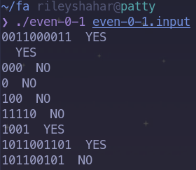

# CS394 HW2

## Sima Nerush and Riley Shahar

Submissions for CS394 HW2

## Regexes

These are implemented in Rust, using the library `plex`. The code matches the
given regex based on the function called in `main`; to change the regex that's
being matched, change the `even_0_1` function to be either `abc` or
`zero_one_one`.

## Automata

These are implemented in `flex` using the provided starter code. We also
implemented a `Makefile` to build in an easier and more automated way without
having to duplicate `make` instructions.

## Indent/Dedent

This is also implemented in `flex`. Our `foo` code handles multiple `foo`s on
the same line. Our `baz` code is as close in logic to the `foo` code as possible
while emitting only one token per call. It turns out you can get very
close---the only substantive difference is that `handle_indentation` returns an
int, which is passed up to `main`, and that `unchomp` is called.

